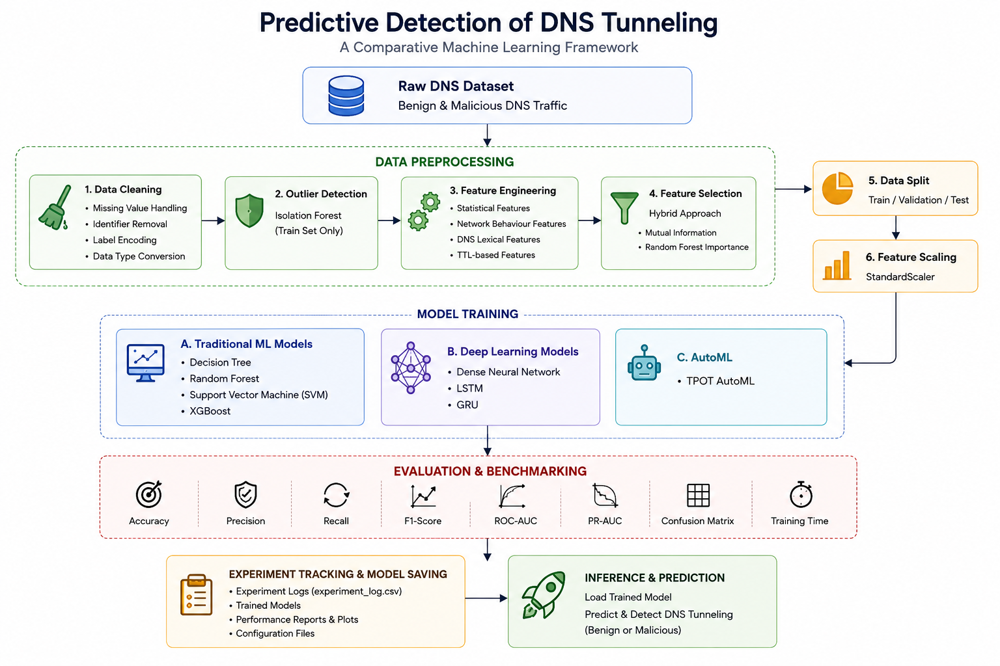
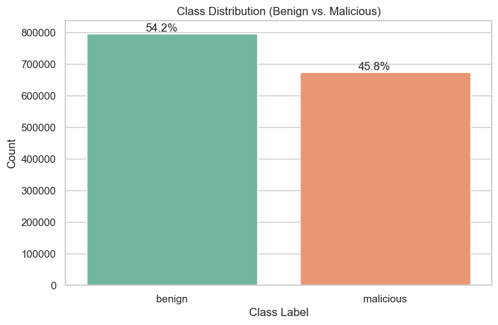
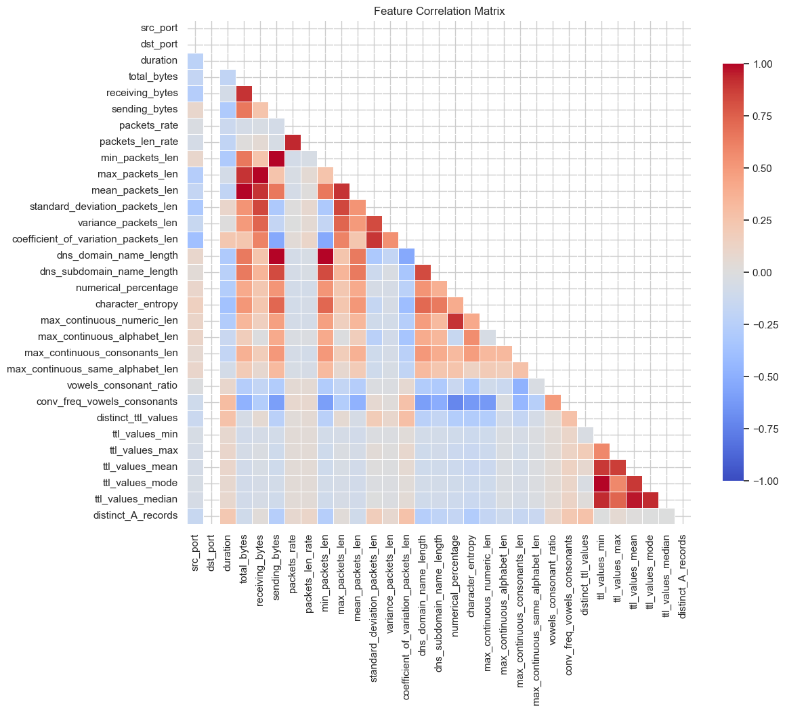
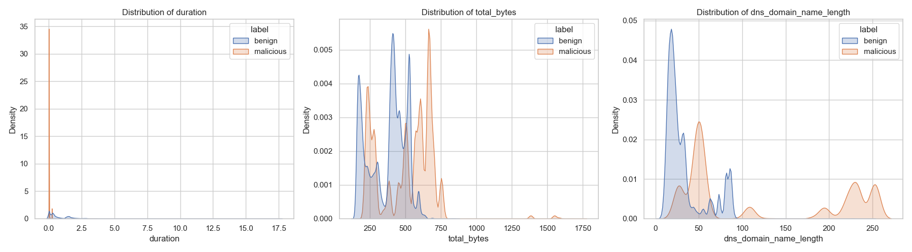
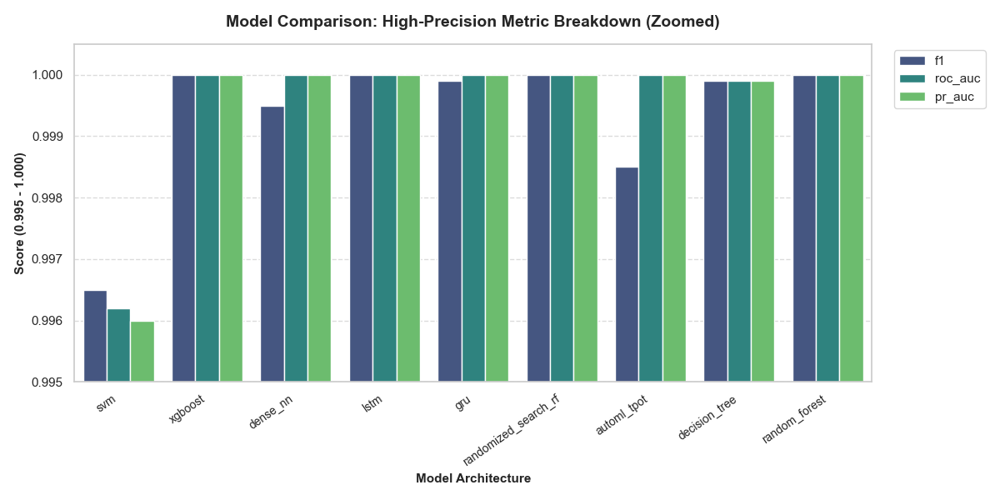
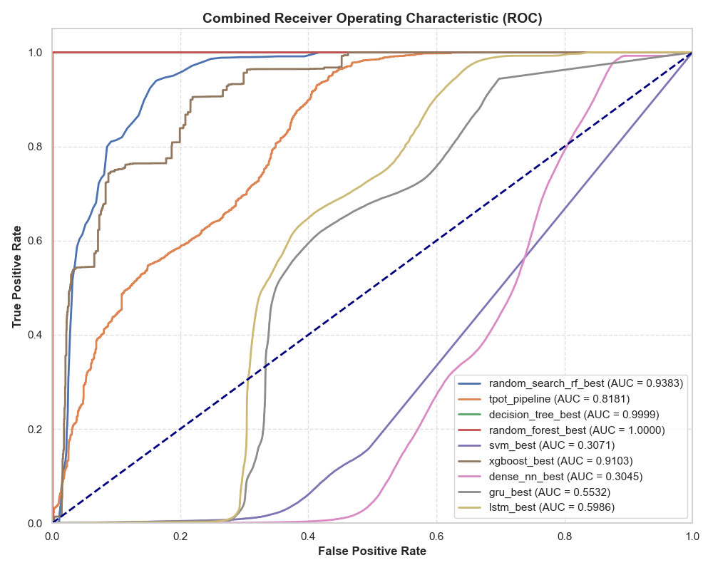
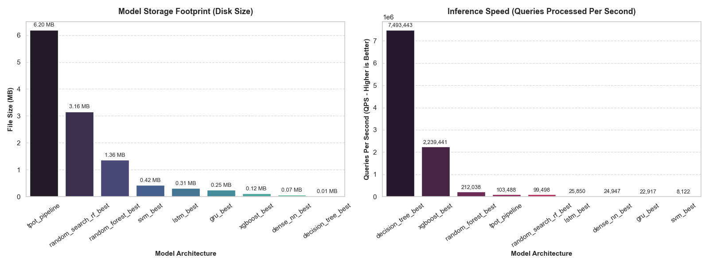
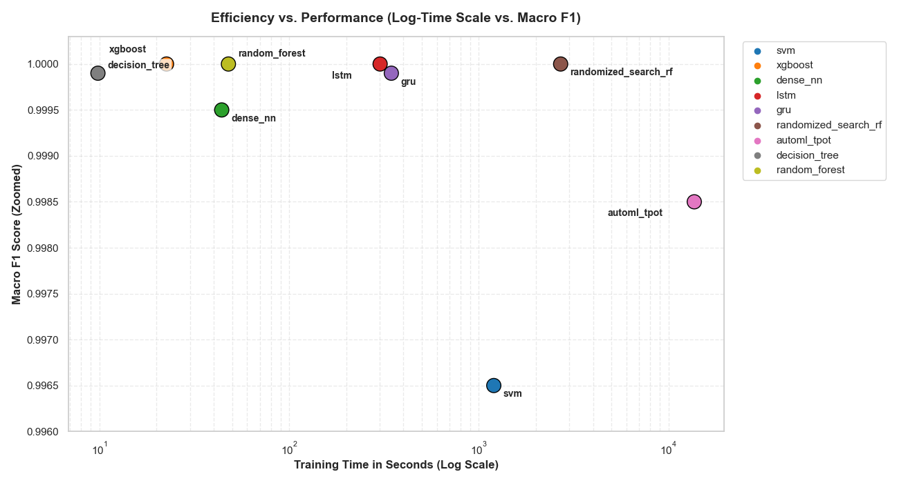

# Predictive Detection of DNS Tunneling: A Comparative Machine Learning Framework

<p align="center">
  
</p>

<p align="center">
  An end-to-end machine learning framework for detecting DNS tunneling attacks through robust data preprocessing, intelligent feature selection, comparative model evaluation, and reproducible experimentation.
</p>

## Key Contributions

- Developed a modular end-to-end framework for predictive DNS tunneling detection.
- Implemented a robust preprocessing pipeline including data cleaning, outlier detection, and feature standardization.
- Applied a hybrid feature selection strategy combining Mutual Information and Random Forest feature importance.
- Benchmarked traditional machine learning, deep learning, and AutoML approaches under a unified experimental setup.
- Evaluated every model using comprehensive performance metrics and systematic experiment tracking.
- Designed the repository with a modular architecture to support reproducible cybersecurity research and future extensibility.

## Quick Navigation

- Why DNS Tunneling Detection Matters
- The Proposed Framework
- Framework Workflow
- Methodology
  - Dataset
  - Data Preprocessing
  - Feature Selection Strategy
  - Model Development
- Experimental Evaluation
- Reproducing the Framework
- Future Directions
- Citation
- License

# Why DNS Tunneling Detection Matters

The Domain Name System (DNS) is one of the most fundamental services on the Internet, translating human-readable domain names into IP addresses to enable communication between users and online resources. Because DNS traffic is indispensable for virtually every network operation, it is often permitted through firewalls and security gateways with minimal restrictions.

This implicit trust has made DNS an attractive target for cyber attackers. By embedding malicious data within DNS queries and responses, adversaries can establish covert communication channels that bypass traditional security controls. This technique, known as **DNS tunneling**, enables attackers to perform data exfiltration, command-and-control (C2) communication, malware delivery, and persistent remote access while masquerading as legitimate DNS traffic.

Unlike conventional network attacks, DNS tunneling closely resembles normal DNS communication, making it particularly difficult to detect using signature-based intrusion detection systems or rule-based monitoring solutions. As attack techniques continue to evolve, manually crafted detection rules often struggle to identify previously unseen or obfuscated tunneling patterns, leading to increased false positives and false negatives.

Machine learning offers a promising alternative by learning the underlying behavioural characteristics of DNS traffic rather than relying on predefined signatures. By analysing statistical, lexical, and network-level features, machine learning models can identify subtle anomalies and complex patterns that distinguish malicious tunneling activity from legitimate DNS communication.

Motivated by these challenges, this project presents a comprehensive machine learning framework for predictive DNS tunneling detection. The framework integrates robust data preprocessing, intelligent feature selection, comparative model evaluation, and reproducible experimentation to provide an end-to-end solution for accurately identifying malicious DNS traffic while maintaining a modular and extensible architecture suitable for cybersecurity research.


# The Proposed Framework

To address the challenges associated with detecting DNS tunneling attacks, this project proposes a comprehensive machine learning framework that combines robust data preprocessing, intelligent feature selection, comparative model evaluation, and reproducible experimentation within a unified workflow. Rather than focusing on a single classification algorithm, the framework is designed to systematically evaluate multiple learning paradigms under identical experimental conditions, enabling an objective comparison of their effectiveness for DNS tunneling detection.

The framework follows a modular architecture in which each stage of the pipeline performs a well-defined task, ranging from data preparation and feature refinement to model training, performance evaluation, and inference. This modular design improves maintainability, simplifies experimentation, and allows individual components to be replaced or extended without affecting the overall workflow.

Unlike conventional implementations that primarily emphasize model accuracy, the proposed framework prioritizes the complete machine learning lifecycle. Every model is trained using the same preprocessing pipeline, feature subset, evaluation metrics, and experimental configuration to ensure fair comparison and reproducibility. This approach enables researchers and practitioners to assess not only predictive performance but also computational efficiency, model robustness, and practical applicability.

The overall architecture of the proposed framework is illustrated below.

<p align="center">
  
</p>

The framework consists of four major components:

### 1. Data Preparation

Raw DNS traffic records are cleaned, validated, and transformed into a consistent numerical representation. Outlier detection and feature standardization improve data quality before model development.

### 2. Feature Refinement

A hybrid feature selection strategy combining Mutual Information and Random Forest Feature Importance identifies the most informative DNS traffic characteristics while reducing redundancy and computational complexity.

### 3. Comparative Model Development

The refined feature set is used to train and evaluate multiple learning paradigms, including traditional machine learning algorithms, deep learning architectures, and AutoML techniques. Evaluating all models under identical conditions enables an unbiased comparison of their strengths and limitations.

### 4. Evaluation and Reproducibility

The framework automatically records evaluation metrics, generated visualizations, trained models, and experiment logs. This ensures reproducibility, facilitates future experimentation, and provides a transparent benchmark for comparative analysis.

Collectively, these components establish an end-to-end framework for predictive DNS tunneling detection that is modular, extensible, and suitable for both cybersecurity research and practical machine learning experimentation.


# Framework Workflow

The proposed framework follows a structured end-to-end workflow that systematically transforms raw DNS traffic records into accurate predictions of benign or malicious activity. Each stage of the pipeline is designed to improve data quality, extract the most informative characteristics, train robust predictive models, and ensure reproducible evaluation. By organizing the workflow into well-defined stages, the framework provides a consistent experimental environment while maintaining flexibility for future enhancements.

The complete workflow of the proposed framework is illustrated below.

<p align="center">
  
</p>

The workflow consists of nine sequential stages, each contributing to the overall predictive capability of the framework.

---

## Stage 1 — Data Acquisition

The workflow begins by loading the DNS traffic dataset containing both benign and malicious DNS communication records. Each record is represented by a collection of statistical, lexical, and network-level attributes extracted from DNS traffic. These records serve as the input for all subsequent stages of the framework.

---

## Stage 2 — Data Preprocessing

Before model development, the dataset undergoes a preprocessing stage to improve data quality and consistency. Irrelevant attributes are removed, missing or inconsistent values are handled, and the data is transformed into a numerical format suitable for machine learning algorithms. This stage ensures that every model receives clean and standardized input.

---

## Stage 3 — Outlier Detection

Network traffic datasets often contain anomalous observations that can negatively influence the learning process. To address this issue, the framework employs an Isolation Forest-based outlier detection strategy to identify and remove abnormal samples from the training data. Eliminating these outliers improves the robustness and stability of the predictive models.

---

## Stage 4 — Feature Selection

Rather than training models using every available attribute, the framework identifies the most informative DNS traffic characteristics through a hybrid feature selection strategy. Mutual Information evaluates the statistical dependency between features and the target variable, while Random Forest Feature Importance measures each feature's contribution during model training. The resulting feature subset provides a compact and discriminative representation of DNS traffic.

---

## Stage 5 — Dataset Preparation

The refined dataset is partitioned into training, validation, and testing subsets to enable unbiased model development and evaluation. Feature scaling is then applied to standardize numerical attributes, ensuring consistent feature distributions across different learning algorithms.

---

## Stage 6 — Model Development

Using the prepared dataset, multiple predictive models are trained under identical experimental conditions. The framework includes traditional machine learning algorithms, deep learning architectures, and AutoML techniques, allowing a comprehensive comparison of different learning paradigms for DNS tunneling detection.

---

## Stage 7 — Performance Evaluation

Each trained model is evaluated using a comprehensive set of performance metrics, including Accuracy, Precision, Recall, F1-Score, ROC-AUC, PR-AUC, Confusion Matrix, and computational efficiency. Applying a consistent evaluation methodology ensures a fair comparison between all implemented models.

---

## Stage 8 — Experiment Management

To support reproducible research, the framework automatically stores trained models, evaluation metrics, visualizations, configuration files, and experiment logs. This systematic experiment management enables future comparisons, model refinement, and transparent reporting of results.

---

## Stage 9 — Inference

The final stage applies the trained model to previously unseen DNS traffic records. Based on the learned patterns within the selected feature space, the framework predicts whether each record represents legitimate DNS communication or a potential DNS tunneling attack, enabling practical deployment in cybersecurity applications.


# Methodology

This section describes the methodology adopted for developing the proposed DNS tunneling detection framework. The methodology encompasses the complete machine learning pipeline, beginning with dataset preparation and preprocessing, followed by feature selection, model development, and performance evaluation. Each stage is designed to improve data quality, enhance predictive performance, and ensure that every model is evaluated under a consistent and reproducible experimental setting.

The methodology is divided into four major components:

- Dataset
- Data Preprocessing
- Feature Selection Strategy
- Model Development

Together, these components establish a systematic workflow for transforming raw DNS traffic records into accurate and reliable predictions of malicious DNS tunneling activity.


## Dataset

### Dataset Overview

The proposed framework is developed using a publicly available DNS traffic dataset containing both benign and malicious DNS communication records. Each record represents a single DNS flow described by a collection of statistical, lexical, and network-level features extracted from DNS traffic. These attributes capture different characteristics of DNS behaviour, enabling machine learning algorithms to distinguish legitimate communication from DNS tunneling activity.

The problem is formulated as a binary classification task in which every DNS record is assigned one of two labels:

- **Benign** – Normal DNS communication.
- **Malicious** – DNS traffic associated with tunneling activity.

Unlike packet-level analysis, the dataset consists of structured numerical features that summarize the behavioural characteristics of DNS communication. This representation significantly reduces computational complexity while preserving the information required for effective classification.


| Property | Description |
|-----------|-------------|
| Application Domain | Network Security |
| Learning Task | Binary Classification |
| Data Type | Structured DNS Traffic Records |
| Classes | Benign, Malicious |
| Feature Types | Statistical, Lexical, and Network-Level |
| Prediction Target | DNS Tunneling Detection |


### Exploratory Data Analysis

Before model development, exploratory data analysis (EDA) was performed to understand the statistical properties of the dataset and identify patterns that could influence predictive performance. The analysis focused on examining class distribution, feature relationships, and the separability between benign and malicious DNS traffic.

The following analyses provide insight into the overall quality and characteristics of the dataset prior to preprocessing and model training.

#### Class Distribution

<p align="center">

</p>

The class distribution illustrates the proportion of benign and malicious DNS traffic records used in this study. Understanding the class balance is important for selecting appropriate evaluation metrics and interpreting model performance.

---

#### Correlation Analysis

<p align="center">

</p>

The correlation matrix highlights relationships among the extracted DNS features. Highly correlated attributes may introduce redundancy, motivating the need for an effective feature selection strategy in later stages of the framework.

---

#### Feature Separability

<p align="center">

</p>

Feature separability analysis provides an initial assessment of how effectively the extracted DNS features distinguish benign traffic from DNS tunneling activity. The observed overlap between classes further justifies the need for advanced machine learning models rather than simple rule-based classification.


## Data Preprocessing

### Overview

The quality of a machine learning model is fundamentally dependent on the quality of the data used during training. Real-world network traffic datasets often contain noisy observations, redundant information, missing values, and inconsistent feature distributions that can adversely affect model performance. Consequently, a comprehensive preprocessing pipeline was implemented to ensure that the input data is clean, consistent, and suitable for robust model development.

The preprocessing pipeline consists of four sequential stages:

1. Data Cleaning
2. Outlier Detection
3. Dataset Partitioning
4. Feature Scaling

Each stage is designed to improve data quality while preserving the behavioural characteristics required for accurate DNS tunneling detection.

---

### Data Cleaning

The preprocessing pipeline begins by inspecting the dataset for inconsistencies that could negatively influence the learning process. Irrelevant attributes that do not contribute to the prediction task are removed, while missing or invalid values are identified and appropriately handled. The remaining features are verified to ensure numerical consistency and compatibility with subsequent machine learning algorithms.

This stage establishes a reliable and standardized feature matrix that serves as the foundation for all downstream processing steps.

---

### Outlier Detection

Network traffic datasets frequently contain anomalous observations that deviate significantly from normal traffic behaviour. These anomalies may originate from corrupted records, measurement errors, or extremely rare traffic patterns that are not representative of the overall dataset.

To improve data quality, the proposed framework employs the **Isolation Forest** algorithm for outlier detection.

Unlike distance-based approaches, Isolation Forest isolates anomalous observations by recursively partitioning the feature space using randomly selected features and split values. Samples that require fewer partitions to become isolated are considered anomalous and are removed from the training dataset.

Applying outlier detection before model training offers several advantages:

- Reduces the influence of noisy observations.
- Improves model robustness.
- Enhances generalization performance.
- Produces more stable decision boundaries.

By removing abnormal training samples, the framework enables predictive models to learn representative DNS traffic patterns more effectively.

---

### Dataset Partitioning

Following preprocessing, the refined dataset is divided into separate subsets for training, validation, and testing.

This partitioning strategy ensures that model development and performance evaluation are conducted on mutually exclusive datasets, thereby preventing information leakage and providing an unbiased assessment of predictive capability.

The three subsets serve distinct purposes:

| Dataset | Purpose |
|----------|---------|
| Training Set | Learns model parameters |
| Validation Set | Hyperparameter tuning and model selection |
| Test Set | Final performance evaluation |

Maintaining this separation throughout the experimental process ensures fair and reproducible model comparison.

---

### Feature Scaling

The extracted DNS features exhibit different numerical ranges and statistical distributions. Algorithms such as Support Vector Machines and neural networks are particularly sensitive to feature magnitude, making normalization an essential preprocessing step.

To address this issue, the framework applies **StandardScaler**, which transforms each feature according to:

\[
z = \frac{x - \mu}{\sigma}
\]

where:

- \(x\) denotes the original feature value,
- \(\mu\) represents the feature mean,
- \(\sigma\) represents the feature standard deviation.

This transformation produces standardized features with zero mean and unit variance, ensuring that every feature contributes proportionally during model training.

Feature scaling offers several practical benefits:

- Faster model convergence.
- Improved optimization stability.
- Balanced feature influence.
- Better performance for distance-based learning algorithms.

The standardized feature matrix generated during this stage serves as the final input for the feature selection strategy and subsequent model development.

## Feature Selection Strategy

### Overview

Feature selection plays a critical role in improving the efficiency and predictive performance of machine learning models. Although the DNS traffic dataset contains numerous statistical, lexical, and network-level attributes, not every feature contributes equally to distinguishing benign DNS communication from malicious tunneling activity. Irrelevant or redundant features may increase computational complexity, introduce noise, and reduce the generalization capability of predictive models.

To address these challenges, the proposed framework employs a hybrid feature selection strategy that combines **Mutual Information (MI)** and **Random Forest Feature Importance**. By integrating both statistical dependency analysis and model-based feature evaluation, the framework identifies a compact subset of highly informative features while preserving the behavioural characteristics essential for DNS tunneling detection.

<p align="center">
    
</p>

The selected feature subset serves as the common input for every machine learning model evaluated in this study, ensuring consistency and fairness throughout the experimental process.

---

### Stage 1 — Mutual Information Analysis

The first stage of the feature selection process evaluates the dependency between each feature and the target class using **Mutual Information (MI)**.

Unlike traditional correlation measures that primarily capture linear relationships, Mutual Information quantifies both linear and non-linear dependencies between variables. Features with higher MI scores provide greater information about the class labels and are therefore considered more informative for distinguishing benign DNS traffic from tunneling attacks.

This initial ranking eliminates weakly informative attributes while retaining features that exhibit strong predictive potential.

---

### Stage 2 — Random Forest Feature Importance

The features retained after Mutual Information analysis undergo a second evaluation using **Random Forest Feature Importance**.

Random Forest estimates the importance of each feature by measuring its contribution to reducing classification impurity across multiple decision trees. Features that consistently improve decision-making throughout the ensemble receive higher importance scores.

Unlike purely statistical methods, this model-based evaluation captures complex feature interactions and non-linear decision boundaries that frequently occur in cybersecurity datasets.

Applying Random Forest after Mutual Information provides an additional layer of validation, ensuring that the selected features are not only statistically relevant but also practically useful during predictive modeling.

---

### Selected Feature Set

The hybrid feature selection strategy identified a refined subset of DNS traffic attributes that collectively provide a comprehensive representation of network behaviour.

The selected features include:

| Feature | Description |
|----------|-------------|
| `ttl_values_mean` | Mean Time-To-Live value |
| `ttl_values_max` | Maximum TTL observed |
| `ttl_values_min` | Minimum TTL observed |
| `ttl_values_median` | Median TTL value |
| `packets_rate` | Packet transmission rate |
| `packets_len_rate` | Packet length rate |
| `duration` | Communication duration |
| `sending_bytes` | Total transmitted bytes |
| `min_packets_len` | Minimum packet length |
| `dns_domain_name_length` | Length of queried domain |
| `character_entropy` | Domain name entropy |
| `numerical_percentage` | Percentage of numeric characters |
| `distinct_A_records` | Number of unique A records |
| `max_continuous_numeric_len` | Longest numeric sequence |
| `max_continuous_consonants_len` | Longest consonant sequence |
| `conv_freq_vowels_consonants` | Vowel-to-consonant frequency ratio |

Together, these features capture multiple aspects of DNS traffic, including packet behaviour, communication characteristics, TTL dynamics, and lexical properties of domain names. This combination provides a highly discriminative representation for detecting DNS tunneling activity.

---

### Advantages of the Hybrid Strategy

The proposed feature selection strategy offers several practical advantages over relying on a single selection technique.

- Captures both statistical dependency and model-driven feature relevance.
- Reduces feature redundancy while preserving informative attributes.
- Improves computational efficiency by reducing input dimensionality.
- Enhances model generalization by minimizing noisy features.
- Provides a common optimized feature space for every evaluated model.

By producing a compact yet informative feature subset, the framework improves training efficiency and establishes a consistent foundation for comparative evaluation across traditional machine learning, deep learning, and AutoML models.


## Model Development

### Overview

The primary objective of this framework is not to demonstrate the effectiveness of a single machine learning algorithm, but to systematically evaluate multiple learning paradigms for predictive DNS tunneling detection under identical experimental conditions. By training every model using the same dataset, preprocessing pipeline, feature subset, and evaluation methodology, the framework enables an objective comparison of their predictive capabilities, computational efficiency, and practical suitability for cybersecurity applications.

Rather than focusing exclusively on accuracy, the comparative analysis also considers model complexity, training efficiency, generalization performance, and inference capability. This comprehensive evaluation provides valuable insight into the strengths and limitations of different approaches when applied to DNS tunneling detection.

The evaluated models are organized into three categories:

- Traditional Machine Learning
- Deep Learning
- Automated Machine Learning (AutoML)

Each category represents a distinct learning paradigm with unique characteristics and practical trade-offs.

---

### Model Selection Rationale

DNS tunneling detection presents a challenging binary classification problem involving statistical, lexical, and network-level features. Different learning algorithms capture these characteristics in different ways. Consequently, evaluating only a single classifier would provide limited insight into the suitability of various approaches for this application.

The proposed framework therefore compares multiple models that differ in learning strategy, computational complexity, interpretability, and predictive capability. This comparative design enables a balanced assessment of both classical and modern machine learning techniques while identifying the most appropriate solution for practical deployment.

---

### Traditional Machine Learning Models

Traditional machine learning algorithms establish strong baseline performance for structured tabular datasets. These models are computationally efficient, relatively interpretable, and well suited for numerical DNS traffic features.

| Model | Purpose | Strengths |
|--------|----------|-----------|
| Decision Tree | Rule-based classification | Fast, interpretable, low computational cost |
| Random Forest | Ensemble learning | High robustness, reduced overfitting |
| Support Vector Machine (SVM) | Margin-based classification | Effective in high-dimensional feature spaces |
| XGBoost | Gradient boosting | Strong predictive performance and efficient optimization |

These algorithms provide an effective benchmark for evaluating more computationally intensive deep learning approaches.

---

### Deep Learning Models

Deep learning architectures are capable of learning complex and highly non-linear feature representations. Although originally developed for sequential and high-dimensional data, they can also capture intricate relationships within structured DNS traffic features.

| Model | Purpose | Strengths |
|--------|----------|-----------|
| Deep Neural Network (DNN) | Fully connected learning | Learns complex feature interactions |
| Long Short-Term Memory (LSTM) | Sequential representation learning | Captures long-range dependencies |
| Gated Recurrent Unit (GRU) | Efficient recurrent learning | Faster training with competitive performance |

Evaluating these architectures provides insight into whether increased model complexity translates into improved DNS tunneling detection performance.

---

### Automated Machine Learning (AutoML)

In addition to manually designed models, the framework evaluates **TPOT AutoML**, an automated machine learning system that searches for optimized model pipelines using genetic programming.

Unlike manually selected algorithms, AutoML automatically explores preprocessing operations, feature transformations, model selection, and hyperparameter optimization to identify high-performing pipelines with minimal human intervention.

Including AutoML provides an additional benchmark that demonstrates the effectiveness of automated model discovery compared with manually engineered solutions.

---

### Comparative Evaluation Framework

All models are trained and evaluated under an identical experimental configuration to ensure a fair comparison.

Every model uses:

- The same DNS traffic dataset.
- The same preprocessing pipeline.
- The same selected feature subset.
- The same train-validation-test split.
- The same evaluation metrics.

<p align="center">
    
</p>

Maintaining a consistent experimental environment ensures that observed performance differences arise from the learning algorithms themselves rather than variations in data preparation or evaluation methodology. This design enables a transparent and reproducible comparison across traditional machine learning, deep learning, and AutoML approaches.


# Experimental Evaluation

This section presents a comprehensive evaluation of the proposed DNS tunneling detection framework. Every model was trained and evaluated under an identical experimental configuration to ensure a fair and unbiased comparison. The objective of this evaluation is not only to identify the highest-performing model but also to analyze the strengths, limitations, computational efficiency, and practical applicability of different learning paradigms for DNS tunneling detection.

The evaluation methodology follows a systematic approach consisting of:

- Experimental Configuration
- Evaluation Metrics
- Performance Comparison
- Receiver Operating Characteristic (ROC) Analysis
- Confusion Matrix Analysis
- Computational Performance
- Discussion

Together, these analyses provide a complete assessment of the predictive capability and robustness of the proposed framework.

## Experimental Configuration

To ensure a fair comparison between all evaluated models, every experiment was performed using a consistent preprocessing pipeline, feature subset, and evaluation methodology. Maintaining identical experimental conditions ensures that performance differences arise from the learning algorithms themselves rather than variations in data preparation or model configuration.

The experimental workflow includes:

- Data preprocessing and cleaning
- Isolation Forest-based outlier detection
- Hybrid feature selection
- Train-validation-test partitioning
- Feature standardization
- Model training
- Performance evaluation
- Experiment logging

All models were trained using the same optimized feature set and evaluated on the identical test dataset to ensure reproducibility and objective comparison.

## Evaluation Metrics

The predictive performance of each model was evaluated using multiple complementary metrics to provide a comprehensive assessment of classification capability.

| Metric | Purpose |
|---------|---------|
| Accuracy | Overall classification performance |
| Precision | Reliability of malicious predictions |
| Recall | Ability to detect DNS tunneling attacks |
| F1-Score | Balance between Precision and Recall |
| ROC-AUC | Overall discriminative capability |
| PR-AUC | Performance under class imbalance |
| Confusion Matrix | Distribution of correct and incorrect predictions |
| Training Time | Computational efficiency |
| Inference Time | Deployment efficiency |

Using multiple evaluation metrics provides a more reliable assessment than relying solely on accuracy, particularly for cybersecurity applications where both false positives and false negatives carry significant consequences.


## Performance Comparison

The comparative evaluation demonstrates the predictive performance of every implemented model under identical experimental conditions.

<p align="center">

</p>

The results indicate clear differences in predictive capability across traditional machine learning, deep learning, and AutoML approaches. While several models achieve competitive performance, the comparative framework highlights the trade-offs between predictive accuracy, robustness, and computational complexity. These observations provide valuable guidance for selecting an appropriate model depending on the deployment requirements.

## ROC Analysis

Receiver Operating Characteristic (ROC) analysis evaluates the discriminative capability of each model across different classification thresholds. Unlike a single accuracy value, ROC curves illustrate the trade-off between the True Positive Rate and False Positive Rate, providing a more comprehensive assessment of classifier performance.

<p align="center">

</p>

Models with curves closer to the upper-left corner demonstrate superior discriminative ability. The corresponding Area Under the Curve (ROC-AUC) values further quantify each model's capability to distinguish benign DNS traffic from tunneling attacks.


## Confusion Matrix Analysis

Confusion matrices provide a detailed breakdown of classification outcomes by reporting correctly and incorrectly classified samples. This analysis helps identify the types of prediction errors produced by each model.

<p align="center">

</p>

A high number of true positives and true negatives, combined with low false positives and false negatives, indicates a reliable detection model. Since cybersecurity applications require minimizing missed attacks while avoiding excessive false alarms, confusion matrix analysis provides important practical insight beyond aggregate performance metrics.


## Computational Performance

Predictive performance alone is insufficient when evaluating models intended for practical deployment. Computational efficiency, including training time, inference latency, and resource requirements, also plays a critical role in selecting an appropriate detection model.

<p align="center">

</p>

The comparative analysis illustrates the trade-off between predictive accuracy and computational cost. Simpler models generally provide faster execution, whereas more sophisticated architectures may achieve higher predictive performance at the expense of increased computational requirements. This comparison enables practitioners to select models that best satisfy their operational constraints.


## Efficiency vs Performance Analysis

<p align="center">

</p>


## Discussion

The experimental results demonstrate that the proposed framework successfully provides a consistent environment for evaluating diverse machine learning paradigms for DNS tunneling detection. By combining robust preprocessing, hybrid feature selection, and standardized evaluation procedures, the framework enables meaningful comparison across traditional machine learning, deep learning, and AutoML approaches.

The study highlights that no single model should be considered universally optimal. Instead, model selection should depend on the specific deployment scenario, balancing predictive performance, computational efficiency, interpretability, and operational requirements. This comparative analysis therefore provides valuable guidance for researchers and practitioners seeking practical solutions for DNS tunneling detection.


# Reproducing the Framework

This section provides the necessary steps to reproduce the complete DNS tunneling detection framework. Following the procedure below will recreate the preprocessing pipeline, feature selection process, model training, evaluation, and experimental results presented in this repository.

The framework has been designed with reproducibility as a primary objective. Every experiment follows an identical workflow, ensuring that the reported results can be independently verified and extended by researchers and practitioners.

## Repository Structure

The repository is organized into modular components, separating datasets, source code, trained models, experimental results, and supporting documentation. This structure improves maintainability while simplifying future experimentation and extension.

```
Predictive-DNS-Tunneling/
│
├── assets/
│   ├── architecture/
│   ├── eda/
│   ├── feature_selection/
│   ├── models/
│   └── results/
│
├── data/
│
├── notebooks/
│
├── models/
│
├── results/
│
├── requirements.txt
│
└── README.md
```

Each directory has a dedicated purpose within the overall framework, allowing individual components to be modified without affecting the remaining pipeline.

## Installation

Clone the repository:

```bash
git clone https://github.com/JnanaranjanPati/Predictive-DNS-Tunneling.git

cd Predictive-DNS-Tunneling
```

Create a virtual environment:

```bash
python -m venv venv
```

Activate it:

Windows

```bash
venv\Scripts\activate
```

Linux / macOS

```bash
source venv/bin/activate
```

Install dependencies:

```bash
pip install -r requirements.txt
```


## Running the Pipeline

The framework follows a sequential workflow in which each stage prepares the input for the subsequent stage.

1. Load the DNS traffic dataset.
2. Perform data preprocessing.
3. Remove anomalous observations using Isolation Forest.
4. Execute the hybrid feature selection strategy.
5. Train the selected machine learning models.
6. Evaluate every model.
7. Generate visualizations and experiment reports.
8. Save trained models and experimental artifacts.

Following this sequence reproduces the complete experimental workflow presented in this repository.

## Generated Outputs

Executing the framework produces several artifacts that facilitate analysis, reproducibility, and future experimentation.

These include:

- Trained machine learning models
- Performance comparison tables
- ROC curves
- Precision–Recall curves
- Confusion matrices
- Feature importance visualizations
- Experimental logs
- Performance metrics

## Customization

The modular architecture allows individual components of the framework to be replaced or extended.

Possible extensions include:

- Integrating additional DNS datasets.
- Evaluating alternative feature selection algorithms.
- Incorporating new machine learning models.
- Performing hyperparameter optimization.
- Deploying trained models for real-time DNS traffic monitoring.

These capabilities make the framework suitable for both academic research and practical cybersecurity applications.


# Future Directions

Although the proposed framework demonstrates strong predictive capability for DNS tunneling detection, several opportunities exist for future enhancement.

Potential research directions include:

- Real-time DNS traffic monitoring.
- Streaming inference using Apache Kafka.
- Transformer-based architectures.
- Explainable AI (XAI) for prediction interpretation.
- Federated learning for privacy-preserving training.
- Continual learning for evolving attack patterns.
- Multi-class classification of different tunneling tools.
- Integration with enterprise SIEM platforms.


# Citation

If you find this repository useful in your research, please consider citing this work.

```bibtex
@misc{dns_tunneling_framework,
  title={Predictive Detection of DNS Tunneling: A Comparative Machine Learning Framework},
  author={Jnanaranjan Pati},
  year={2026},
  publisher={GitHub},
  url={https://github.com/JnanaranjanPati/Predictive-DNS-Tunneling}
}
```

# License

This project is released under the MIT License. See the LICENSE file for additional details.


